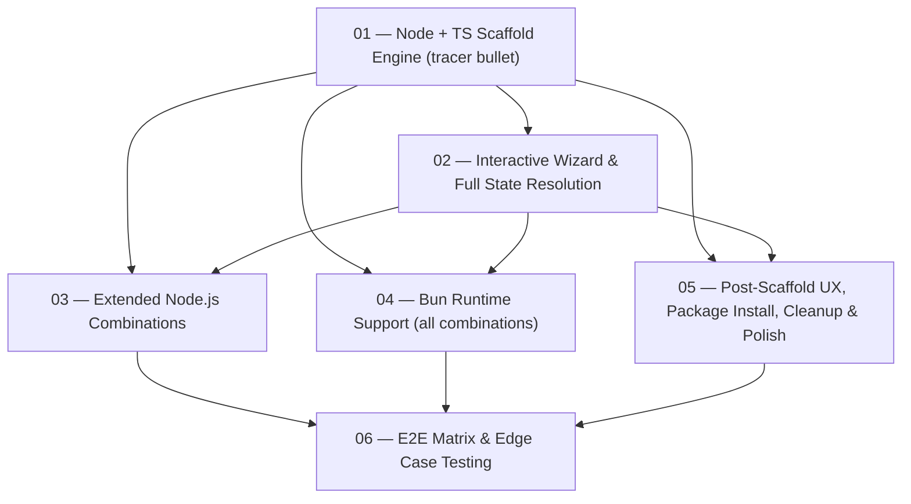

# Assembly Report — tix-create-ink-app-scaffold

**Date:** 2026-07-26
**Agent:** tix-assembler v0.0.1

---

## Summary

- **Total tickets written:** 6
- **Ticket file:** `_xzy-ai/sprints/tix-create-ink-app-scaffold/ticket.md`
- **Assembly report:** `_xzy-ai/sprints/tix-create-ink-app-scaffold/tickets/assembly-report.md`

---

## Validation Results

### Upstream Artifacts

| Artifact | Path | Status |
|----------|------|--------|
| Workspace Summary | `tickets/workspace-summary.md` | ✅ Present, 591 lines, non-empty |
| Ticket Plan | `tickets/ticket-plan.md` | ✅ Present, 219 lines, non-empty |
| Planning Output | `tickets/planning-output.yaml` | ✅ Present, 112 lines, non-empty |

### Ticket Structure

| Check | Result |
|-------|--------|
| Tickets array non-empty (6 tickets) | ✅ Pass |
| Every ticket has `title` | ✅ Pass |
| Every ticket has `blocked_by` | ✅ Pass |
| Every ticket has `what_it_delivers` | ✅ Pass |
| Every ticket has `acceptance_criteria` (non-empty) | ✅ Pass |
| Every `blocked_by` entry references an existing ticket title | ✅ Pass |
| No circular dependencies | ✅ Pass |
| Dependency graph is a valid DAG | ✅ Pass |

### Dependency Graph (DAG)

---

## Ticket Numbering & Dependency Ordering

Tickets were topologically sorted so that every ticket's blockers appear before it. Where two tickets had no dependency relationship, their original order from the planning output was preserved (stable sort).

| Number | Ticket Title | Dependencies |
|--------|-------------|--------------|
| 01 | Node + TypeScript Scaffold Engine (tracer bullet) | None — can start immediately |
| 02 | Interactive Wizard & Full State Resolution | 01 |
| 03 | Extended Node.js Combinations | 01, 02 |
| 04 | Bun Runtime Support (all combinations) | 01, 02 |
| 05 | Post-Scaffold UX, Package Install, Cleanup & Polish | 01, 02 |
| 06 | E2E Matrix & Edge Case Testing | 03, 04, 05 |

**Ordering rationale:**
- Ticket 01 has no blockers and is the foundation for all other tickets.
- Ticket 02 depends only on Ticket 01 (uses WizardState types, CliFlags interface, and validation module).
- Tickets 03, 04, and 05 all depend on Tickets 01 and 02 but have no interdependencies — they are parallelizable. Their numbering preserves the original planning output order.
- Ticket 06 depends on Tickets 03, 04, and 05 (all feature combinations must be complete before E2E testing).

---

## Consistency Issues Found & Resolved

| Issue | Resolution |
|-------|-----------|
| The user-provided ticket summary mentioned Ticket 2 as having "7 criteria" but the actual planning output YAML contains 8 criteria. | Used the YAML data as authoritative. No data loss — all 8 criteria from the planning output are included in ticket 02. |
| The user-provided ticket summary mentioned Ticket 4 as having "7 criteria" but the actual planning output YAML contains 8 criteria. | Used the YAML data as authoritative. All 8 criteria from the planning output are included in ticket 04. |
| Several ticket blocked_by references use full ticket titles matching the `title` field exactly. | All references validated against the planning output titles — no broken references found. |

**No critical consistency issues were found.** The ticket breakdown from the Ticket Planning Agent is internally consistent and ready for implementation.

---

## Domain Vocabulary Used

The following domain terms (from the workspace summary glossary) are used consistently across all tickets:

| Term | Usage |
|------|-------|
| WizardState | Central immutable data contract; created by Tickets 01 and 02, consumed by all downstream tickets |
| CliFlags | CLI flag interface parsed by `mri`; defined in Ticket 01, extended by Ticket 02 |
| Scaffold engine | Core module implemented in Ticket 01, extended by Tickets 03 and 04 |
| Template substitution | `<% VAR %>` regex-based substitution; implemented in Ticket 01 |
| ConfigGenerator | Programmatic config generation pattern; used in Tickets 01, 03, 04 |
| compat.json | Version compatibility mapping; generated in Tickets 01, 03, 04 |
| Non-interactive mode | Full flag-based mode; implemented in Ticket 02 |
| Mixed mode | Partial flags + wizard; implemented in Ticket 02 |
| Runtime | Node.js (Ticket 03) or Bun (Ticket 04) |
| E2E matrix | 8-combination test matrix; validated in Ticket 06 |
| ScaffoldResult | Return type of scaffold engine; used in Tickets 01, 03, 04, 05 |
| FileEntry | Config generator output type; used in Tickets 01, 03, 04 |
| Latest-only policy | Always latest Ink v6+ / React 19+; applies across all tickets |
| Hybrid template architecture | Base templates + programmatic config; used by all scaffold tickets |

---

## Recommendations for Picking Up Tickets

1. **Start with Ticket 01** — This is the tracer bullet that validates the entire architecture. It unblocks every downstream ticket (02, 03, 04, 05). Without it, nothing else can proceed.

2. **Ticket 02 is next** — It depends only on Ticket 01 (types, validation module) and unblocks Tickets 03, 04, and 05. It should be started immediately after Ticket 01 completes.

3. **Parallel execution for Tickets 03, 04, 05** — Once Tickets 01 and 02 are complete, these three tickets have no interdependencies. A team of 3 (or 3 agents) can work them simultaneously. Recommended dispatch order:
   - **Ticket 03** (Extended Node.js) — Largest scope, builds on the tracer bullet foundation
   - **Ticket 04** (Bun Runtime) — Medium scope, parallels Ticket 03
   - **Ticket 05** (Post-Scaffold UX) — Smaller scope, can be done alongside 03 and 04

4. **Ticket 06 last** — Requires all feature tickets (03, 04, 05) to be complete. This is the validation gate.

5. **Use `dispatch-for-implementation` skill** — For parallel execution of Tickets 03, 04, and 05, use the `dispatch-for-implementation` skill which natively integrates with `ticket.md` and supports multi-agent parallel execution.

---

## Quality Gate Validation

| Gate | Status |
|------|--------|
| Consolidated ticket file written | ✅ `ticket.md` exists at sprint root |
| Correct numbering (01–06) | ✅ Tickets numbered in dependency order |
| Valid blocking references | ✅ Every "Blocked by" points to an existing ticket number/title |
| No circular dependencies | ✅ DAG is acyclic; verified by topological sort |
| Template compliance | ✅ Each ticket follows the template (title, What to build, Blocked by, Status, acceptance criteria) |
| Assembly report | ✅ Present at `tickets/assembly-report.md` with substantive content |
