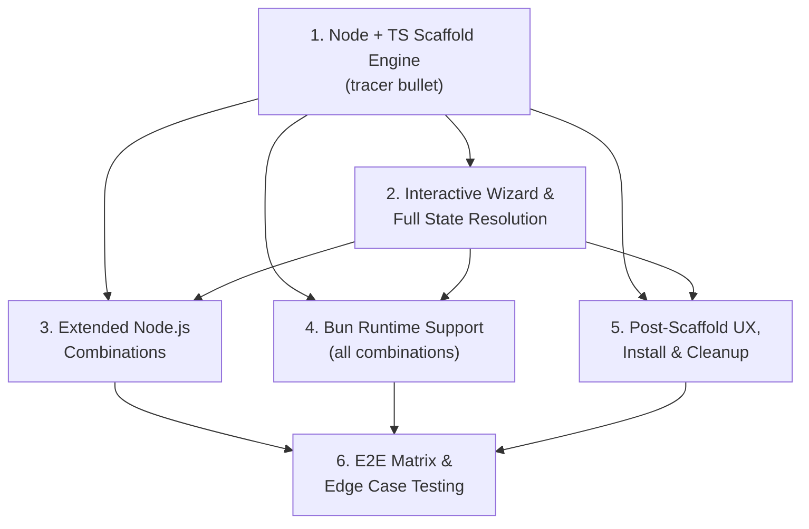

# Ticket Plan

## Context

We are building `@xzy-ai/create-ink-app`, a greenfield scaffolding tool for Ink terminal applications. The tool generates starter Ink projects with modern tooling via an interactive wizard (TTY), non-interactive CLI flags (CI/CD/AI agents), or mixed mode. It supports 2 runtimes (Node.js and Bun), 2 languages (TypeScript and JavaScript), 3 linter/formatter options (Biome, ESLint+Prettier, none), and 3 pre-commit hook options (Lefthook, Husky, none) — 36 theoretical combinations validated by an 8-combination E2E matrix.

The project uses a **hybrid template architecture**: base template files in `templates/<runtime>/<language>/` for source code (app.tsx, cli.tsx, test.tsx) combined with programmatic config generation for all tool configuration files (package.json, biome.json, eslint.config.js, .prettierrc, vitest.config.ts, lefthook.yml, .husky/pre-commit, tsconfig.json, compat.json). Template placeholders use `<% VAR %>` EJS-style regex substitution.

**Operating modes:** Fully interactive (TTY with @clack/prompts), fully non-interactive (`--no-interactive` with all CLI flags), and mixed mode (some flags + prompts for remaining). Package manager is auto-detected from `npm_config_user_agent`. Version policy is latest-only (Ink v6+, React 19+).

**User decisions:** Include `--dry-run` flag (YES), include MIT license (YES), validate runtime installed (YES), defer CI setup, defer npm publishing.

## Domain Vocabulary

| Term | Definition |
|------|------------|
| **WizardState** | Central immutable data contract shared across all modules containing all user choices |
| **Scaffold engine** | Core module (`scaffold.ts`) that copies base templates, runs config generators, performs template substitution, formats output, and installs dependencies |
| **Template substitution** | Process of replacing `<% VAR %>` placeholders in template files using regex |
| **ConfigGenerator** | Pure function `(state: WizardState) => FileEntry \| null` for generating tool configuration files |
| **Programmatic config generation** | Generating configuration files by constructing JS objects in code rather than using template files |
| **Hybrid template architecture** | Combining base template directories with programmatic config generation for maximum flexibility |
| **ScaffoldResult** | Return type of the scaffold engine containing `targetDir`, `filesCreated`, `installCompleted`, `warnings` |
| **FileEntry** | Interface for config generator output: `path`, `content`, optional `executable` flag |
| **compat.json** | Bundled JSON file mapping runtime × Ink × React versions for compatibility validation |
| **Non-interactive mode** | CLI operation without prompts, controlled via `--no-interactive` flag for CI/CD/AI agents |
| **Mixed mode** | Operation where some flags are provided and the wizard prompts for remaining options |
| **Runtime** | The JavaScript runtime environment for the scaffolded project: Node.js or Bun |
| **Latest-only policy** | Always scaffold latest stable Ink (v6+) and React (19+); no version selection in wizard |
| **E2E matrix** | 8 scaffold combinations for comprehensive testing covering all runtime × language × linter × pre-commit options |
| **CliFlags** | Interface for CLI flag parsing with mri covering all wizard options plus --help, --version, --no-interactive, --overwrite, --immediate, --dry-run |

## Prefactoring

None required. The project is greenfield — no existing code to refactor, no backward compatibility requirements with the old `create-ink-app` v3.0.2 reference implementation.

## Tickets

---

### 1. Node + TypeScript Scaffold Engine (tracer bullet)

**What to build:** The first complete end-to-end vertical slice. Running `create-ink-app my-app --no-interactive` scaffolds a complete, runnable Node.js + TypeScript Ink project with Biome linter, Lefthook pre-commit hooks, MIT license, and all shared infrastructure files. This ticket validates the full architecture — project setup, core types, template substitution, scaffold engine, programmatic config generators, base templates, CLI entry, validation, and tests — before building out the remaining combinations.

**Blocked by:** None — can start immediately

**Acceptance criteria:**

- [ ] `create-ink-app my-app --no-interactive` creates a valid project directory at `./my-app/`
- [ ] Generated project contains all required files:
  - Source: `source/app.tsx`, `source/cli.tsx` (with `.template` substitution), `test.tsx`
  - Config: `package.json`, `tsconfig.json`, `biome.json`, `lefthook.yml`, `compat.json`
  - Shared: `.gitignore`, `.editorconfig`, `readme.md`, `LICENSE` (MIT)
- [ ] `package.json` has correct `name` field matching the project name, correct scripts (`build`, `dev`, `start`, `test`, `lint`, `format`, `check`, `typecheck`), and dependencies with Ink v6+ and React 19+
- [ ] Template substitution replaces `<% PROJECT_NAME %>`, `<% BINARY_NAME %>`, and `<% RUNTIME %>` in `.template` files and strips the `.template` suffix in output
- [ ] `biome.json` has recommended defaults with `source/` include paths
- [ ] `lefthook.yml` has pre-commit hooks for linting and type-checking with parallel execution
- [ ] `tsconfig.json` has strict mode enabled with `source/` as the source root
- [ ] `compat.json` records the scaffolding tool version, runtime, and Ink/React version mapping
- [ ] `create-ink-app --help` displays usage instructions with all available flags
- [ ] `create-ink-app --version` displays the current package version
- [ ] Invalid project name (uppercase, leading dot/underscore, spaces) produces a clear error message and exits with code 1
- [ ] Scaffolding into a non-empty directory prompts for confirmation
- [ ] Unit tests (pure functions) cover: template substitution engine with multiple variables, biome.json generator, lefthook.yml generator, tsconfig.json generator, package.json generator for Node+TS, project name validation
- [ ] Integration tests (real temp directories via `tempy`, `execa` mocked) cover: scaffold engine producing correct file tree, template substitution during scaffold, all config generators producing expected output, format of generated package.json is valid JSON
- [ ] Scaffolding tool's own `package.json`, `tsconfig.json`, and `vitest` config are properly set up

---

### 2. Interactive Wizard & Full State Resolution

**What to build:** The complete interactive wizard experience with `@clack/prompts` covering all scaffolding options, plus the full CLI flag set for non-interactive and mixed modes. Environment detection identifies TTY vs non-TTY, AI agent environments (via `@vercel/detect-agent`), and the current package manager (via `npm_config_user_agent`). State resolution follows the precedence: CLI flags > interactive prompts > defaults. All three operating modes are fully functional.

**Blocked by:** Ticket 1 (uses WizardState types, CliFlags interface, and validation module)

**Acceptance criteria:**

- [ ] Running `create-ink-app` with no arguments in a TTY terminal starts the interactive wizard with `@clack/prompts` `intro()` and `group()`
- [ ] Wizard prompts in order: project name (text with inline validation), runtime (select: Node/Bun), language (select: TypeScript/JavaScript), package manager (select: auto-detected default + override option), linter (select: Biome/ESLint+Prettier/none), test framework (auto-derived from runtime, displayed as info), pre-commit hooks (select: Lefthook/Husky/none), install dependencies (confirm)
- [ ] All CLI flags parsed by `mri`: `--runtime`, `--language`, `--linter`, `--test`, `--precommit`, `--pm`, `--overwrite`, `--no-overwrite`, `--immediate`, `--no-interactive`, `--dry-run`, `--help`, `--version`
- [ ] Resolution precedence is strictly: CLI flag values > interactive prompt results > default values
- [ ] Fully non-interactive mode (`--no-interactive`): skips all prompts, requires project name positional arg, applies defaults for unspecified flags, exits with code 1 if project name is missing
- [ ] Mixed mode: provided flags pre-fill wizard prompts with those values as defaults, remaining options still prompted
- [ ] Non-TTY detection (`process.stdin.isTTY`): automatically falls back to non-interactive mode with a message
- [ ] AI agent detection (`@vercel/detect-agent`): displays helpful usage hint showing non-interactive flag syntax when an agent is detected
- [ ] Package manager detection: reads `process.env.npm_config_user_agent`, correctly identifies npm/pnpm/yarn/bun, defaults to npm when unset
- [ ] `--help` and `--version` exit immediately after display without entering the wizard
- [ ] Integration tests: wizard state construction from flags, from prompts (mocked), mixed mode resolution, non-interactive mode with all flags, non-interactive mode with missing flags, package manager detection, AI agent detection

---

### 3. Extended Node.js Combinations (JavaScript, ESLint+Prettier, Husky, dry-run, runtime validation)

**What to build:** Extends the Node.js scaffold engine beyond the tracer bullet combination to support all remaining Node.js options. JavaScript language scaffolds produce `.jsx` files. ESLint+Prettier generates `eslint.config.js` (flat config) and `.prettierrc`. Husky generates `.husky/pre-commit` shell hooks. An explicit `vitest.config.ts` is generated for Node scaffolds. The `--dry-run` flag previews scaffold output without writing files. Runtime validation confirms Node.js is installed before scaffolding begins.

**Blocked by:** Ticket 1 (scaffold engine, config generator pattern), Ticket 2 (wizard produces state for all options)

**Acceptance criteria:**

- [ ] Node + JavaScript scaffold: creates `.jsx` source files, `.jsx` test file, correct `package.json` with JS-specific settings, no `tsconfig.json`
- [ ] ESLint + Prettier selection: generates `eslint.config.js` (ESM flat config format with `@eslint/js` and `eslint-plugin-react` recommended configs), `.prettierrc` with sensible defaults, and `lint`/`format` scripts in `package.json`
- [ ] Biome + ESLint+Prettier are mutually exclusive — selecting one excludes the other
- [ ] Husky selection: generates `.husky/pre-commit` shell script with lint-staged-style linting command, `.husky/` directory with proper `.gitignore`
- [ ] Lefthook + Husky are mutually exclusive — selecting one excludes the other
- [ ] No linter selection: no biome.json, eslint.config.js, or .prettierrc generated
- [ ] No pre-commit selection: no lefthook.yml or .husky/ generated
- [ ] `vitest.config.ts` is generated for Node scaffolds with `ink-testing-library` react renderer configuration
- [ ] `--dry-run` flag: shows all files that would be created (paths, sizes) without writing anything to disk, exits with code 0
- [ ] Runtime validation: `node --version` is called before scaffolding; failure produces a clear error message and exits with code 1
- [ ] MIT license: LICENSE file contains the standard MIT license text with the project name as the copyright holder
- [ ] Unit tests: eslint.config.js generator, .prettierrc generator, Husky generator functions, vitest.config.ts generator, dry-run logic, runtime validation function
- [ ] Integration tests: scaffold engine produces correct files for each extended combination

---

### 4. Bun Runtime Support (all combinations)

**What to build:** Full Bun runtime support across all language, linter, and pre-commit combinations. Bun scaffolds use Bun-native tooling: `bun build` for compilation, `bun test` for testing (with `bun:test`), Bun's built-in TypeScript support, and Bun-specific package scripts. The scaffold engine copies from `templates/bun/<language>/` and generates Bun-appropriate config files. Runtime validation checks Bun is installed. No `vitest.config.ts` is generated (Bun uses its built-in test runner).

**Blocked by:** Ticket 1 (scaffold engine, template system), Ticket 2 (wizard produces state for Bun runtime choice)

**Acceptance criteria:**

- [ ] Bun + TypeScript scaffold: creates complete project using `templates/bun/ts/` base templates, correct `package.json` with `bun build`, `bun run dev`, `bun start`, `bun test` scripts
- [ ] Bun + JavaScript scaffold: creates `.jsx` source files with Bun scripts, no `tsconfig.json`
- [ ] Bun `package.json` scripts: `build` = `bun build ./source/cli.tsx --outdir=dist --target=bun`, `dev` = `bun --watch ./source/cli.tsx`, `start` = `bun ./source/cli.tsx`, `test` = `bun test`
- [ ] Bun scaffold has no `vitest.config.ts` — test config is handled by `bun:test` built-in
- [ ] Bun scaffold shebang in `cli.tsx`: `#!/usr/bin/env bun`
- [ ] Bun `.gitignore` includes `bun.lock` entries
- [ ] Bun `package.json` does not set `engines.node` field
- [ ] Bun scaffold works with all linter options: Biome, ESLint+Prettier, none (config generators are runtime-agnostic)
- [ ] Bun scaffold works with all pre-commit options: Lefthook, Husky, none
- [ ] Runtime validation: `bun --version` is called before Bun scaffolding; failure produces clear error and exits with code 1
- [ ] Unit tests: Bun package.json generator (scripts comparison), Bun template content validation
- [ ] Integration tests: scaffold engine produces correct Bun project for all combinations (Bun+TS+Biome+Lefthook, Bun+JS+ESLint+Prettier+none, Bun+TS+none+none)

---

### 5. Post-Scaffold UX, Package Install, Cleanup & Polish

**What to build:** The complete post-scaffold user experience. After successful scaffolding, a runtime-aware success message via `@clack/prompts` `outro()` shows the correct dev command and a summary of chosen options. The `--immediate` flag auto-installs dependencies using the detected package manager (via `execa`) with a spinner progress indicator. SIGINT/SIGTERM signal handlers clean up partial output on interruption. Cancellation at any prompt is handled gracefully with code 0 exit. Directory handling covers all overwrite modes, current-directory scaffolding (`.`), and permission errors.

**Blocked by:** Ticket 1 (scaffold engine), Ticket 2 (wizard produces full state including install/immediate/overwrite flags)

**Acceptance criteria:**

- [ ] Post-scaffold `outro()` displays: runtime-aware dev command (`npm run dev` for Node, `bun run dev` for Bun), a summary of user's selected options, and the target directory path
- [ ] `--immediate` with install confirmation = yes: runs package manager install via `execa` with a `spinner()` progress indicator, shows next-step instructions on completion
- [ ] `--immediate` with install confirmation = no: skips install but still shows next-step instructions with the install command the user should run
- [ ] Install command uses the detected/selected package manager: `npm install`, `pnpm install`, `yarn`, or `bun install`
- [ ] Failed install (network error, package manager not found): shows clear error message, exits with code 1, does NOT clean up scaffolded files
- [ ] SIGINT during scaffolding (file copy or install): shows "Operation cancelled" message, cleans up partial scaffold directory, exits with code 0
- [ ] SIGTERM during scaffolding: same behavior as SIGINT
- [ ] Cancellation at any wizard prompt (Ctrl+C or Escape): shows formatted cancel message via `@clack/prompts` `cancel()`, exits with code 0, no files written
- [ ] Directory overwrite modes: `--overwrite` auto-overwrites, `--no-overwrite` refuses with error, no flag = prompts user in interactive mode (default: no), fails with clear message in non-interactive mode
- [ ] `.` as project name: scaffolds into the current working directory, uses the current directory name as the npm package name
- [ ] Directory not writable: detected early with clear error message, exits with code 1
- [ ] Integration tests: post-scaffold message content, execa install call patterns, cleanup on simulated SIGINT, directory handling scenarios

---

### 6. E2E Matrix & Edge Case Testing

**What to build:** Comprehensive end-to-end testing infrastructure and execution for all 8 scaffold combinations across all three operating modes. Includes test fixture helpers (`createState()`, minimal templates, expected outputs) and edge case coverage (spaces in paths, special characters, cross-platform path handling, Windows path separator handling).

**Blocked by:** Ticket 3 (all Node.js combinations), Ticket 4 (all Bun combinations), Ticket 5 (post-scaffold UX and cleanup complete — needed for full-flow E2E)

**Acceptance criteria:**

- [ ] Test fixtures exist at `test/fixtures/`: `state.ts` with `createState()` helper for constructing WizardState with sensible defaults and per-test overrides; minimal template directories for scaffold engine tests; expected output snapshots for all config generators
- [ ] All 8 E2E matrix combinations pass (scaffold → file verification → install → build → test):
  1. Node + TypeScript + Biome + Lefthook
  2. Node + JavaScript + ESLint+Prettier + none
  3. Node + TypeScript + none + Husky
  4. Bun + TypeScript + Biome + Lefthook
  5. Bun + JavaScript + ESLint+Prettier + none
  6. Bun + TypeScript + none + none
  7. Node + TypeScript + ESLint+Prettier + none
  8. Node + JavaScript + Biome + Lefthook
- [ ] Each E2E test validates: correct files created, correct file content (key assertions), `package.json` is valid, build script succeeds, test script passes
- [ ] All three operating mode E2E tests pass: fully interactive (mocked prompts), fully non-interactive (all flags), mixed mode (partial flags + mocked prompts)
- [ ] Edge case tests pass: project name with spaces (handled as directory), leading dot project name (hidden directory), leading dot + uppercase normalized for npm name, scaffold into current directory (`.`)
- [ ] Cross-platform path handling tests: template paths use `path` module, forward slashes in source work on all platforms, Windows path separator handling confirmed in documentation
- [ ] E2E tests are gated to run only in CI (nightly/pre-release) with parallel matrix strategy and 10-minute timeout per combination
- [ ] Unit and integration tests from all prior tickets remain passing

---

## Dependency Graph

**Execution strategy:**
1. **Build the backbone** — Tickets 1 + 2 sequentially (Ticket 2 needs Ticket 1's types and validation module)
2. **Fan out in parallel** — Tickets 3, 4, and 5 are independent once Tickets 1 and 2 are complete. A team of 3 can work them simultaneously.
3. **Validate everything** — Ticket 6 bundles all E2E and edge case testing after all features are complete.

## Wide Refactors

None required. The entire codebase is greenfield — there are no existing symbols, column names, or shared types to rename. All modules are built from scratch in their final form.
